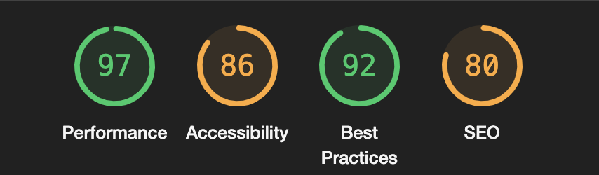
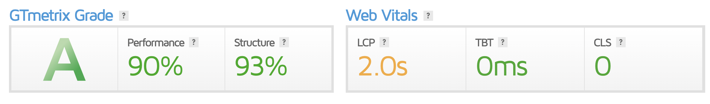
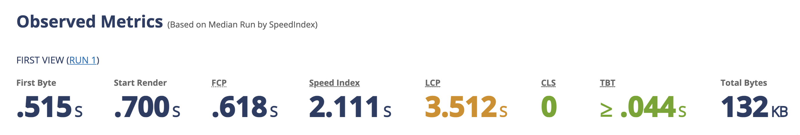
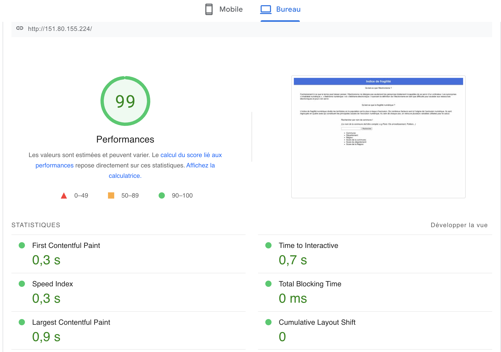
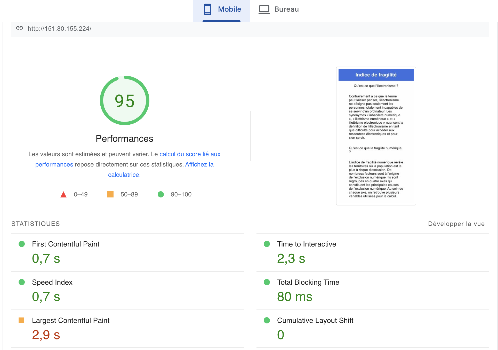

# Green It Project

Andrea ECHEVERRIA - Ewan LEMEE - Théo Ambrois

http://151.80.155.224/ -> Pour acceder au site.

http://151.80.155.224:8901/ -> Pour acceder à Phpmyadmin. (root/r9QAt@SnNBon3N&i)

## Installation

1. Cloner le repo sur votre machine.
2. Aller dans le dossier front du projet et lancer la commande : ```npm install && npm run build```
3. Aller dans le dossier api et lancer la commande : ```npm install```
4. ```docker-compose up -d```
5. Acceder à phpmyadmin et importer dans la db app le script "indicator.sql"

## Environnement
### Front
Pour le front, le framework JS Lit est utilisé.
Il s'agit d'un framework JS comparable à ReactJS, mais en beaucoup plus léger.

Snowpack est utilisé pour la compilation du front, comme pour Lit, il s'agit d'une alternative à Webpack.

Un service worker est également intégré pour gérer les caches et s'assurer que le site est toujours en cache.
### Back
Pour le back, le framework NodeJS est utilisé avec Express et Sequelize pour accéder à la base de données.
## Score du projet
Lighthouse:


gtmetrix:


webpagetest:


pageSpeed insights (desktop):


pageSpeed insights (mobile):

